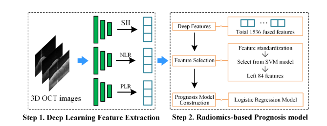
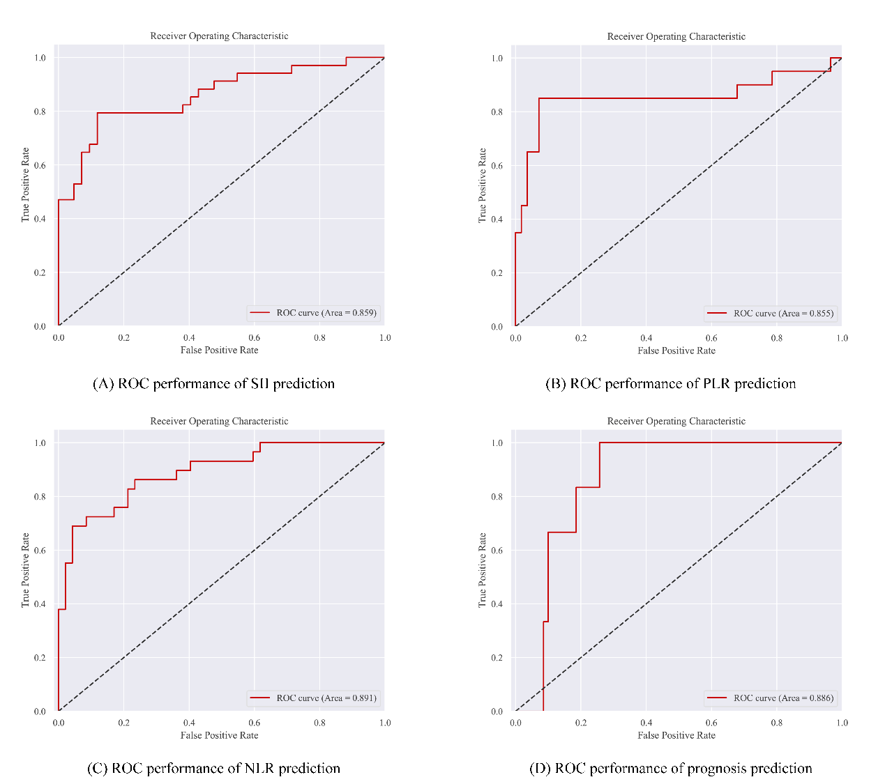

# Deep Radiomics-based Prognostic Prediction of Oral Cancer using Optical Coherence Tomography


<div style="width: 100%; text-align: center;">
    
</div>
This repository is the official pytorch implementation for paper: [Deep Radiomics-based Prognostic Prediction of Oral Cancer using Optical Coherence Tomography]()

## Requirements

```
pip install -r requirements.txt
```

## Dataset
In this study, Optical Coherence Tomography (OCT) was utilized to examine ex vivo oral mucosal specimens. A total of 289 specimens were gathered from 68 patients, which were then translated into a dataset comprising 1485 OCT images. Following the collection, all 68 patients underwent curative resection surgery. Postoperative treatments varied among the patients: 5 received chemotherapy, 11 underwent radiotherapy, and 9 were treated with a combination of both chemotherapy and radiotherapy. Over the course of the subsequent follow-up period, there were 12 instances of tumor recurrence and/or metastasis, while the remaining 56 cases exhibited no signs of disease progression.


## Training & Testing

The code is tested under a Linux desktop with torch 2.0.1 and Python 3.10. All experiments are conducted on a single NVIDIA GeForce RTX4090 with 24GB memory.

**Training:**

For the SII results, we can implement the model by running the following command:

```python
CUDA_VISIBLE_DEVICES=0 python main_oct_split5_SII.py 
```
```python
CUDA_VISIBLE_DEVICES=0 python main_oct_split5_SII_lstm.py.py 
```
For the PLR results, we can implement the model by running the following command:

```python
CUDA_VISIBLE_DEVICES=0 python main_oct_split5_PLR.py
```
```python
CUDA_VISIBLE_DEVICES=0 python main_oct_split5_PLR_lstm.py
```
For the NLR results, we can implement the model by running the following command:
```python
CUDA_VISIBLE_DEVICES=0 python main_oct_split5_NLR.py
```
```python
CUDA_VISIBLE_DEVICES=0 python main_oct_split5_NLR_lstm.py
```


**Testing:**

```
python evaluate_roc.py
```




## Citation

If you are using the provided codes or find this work helpful for your project, please give it a star and a citation:

```
@article{
title=Deep Radiomics-based Prognostic Prediction of Oral Cancer using Optical Coherence Tomography
}
```
